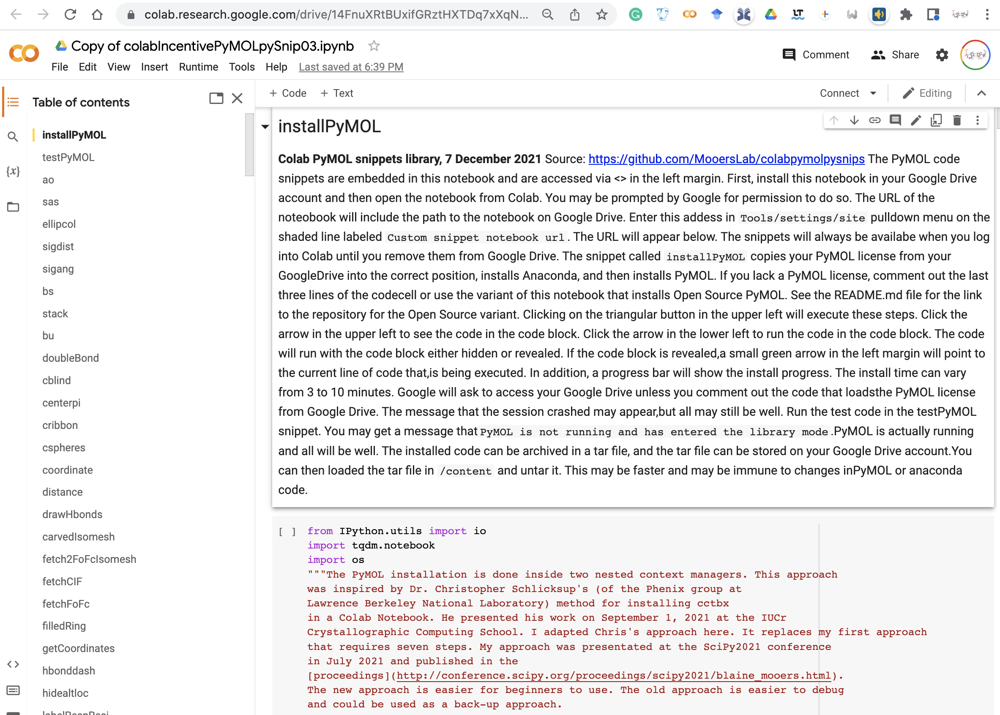
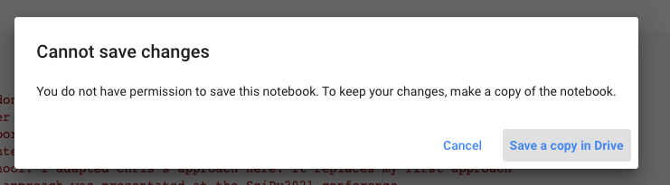
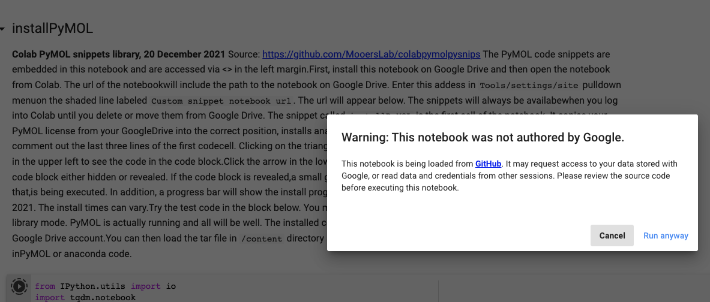
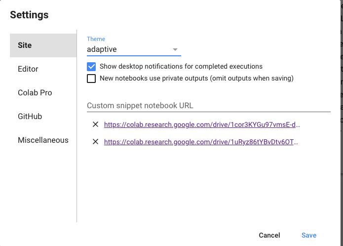
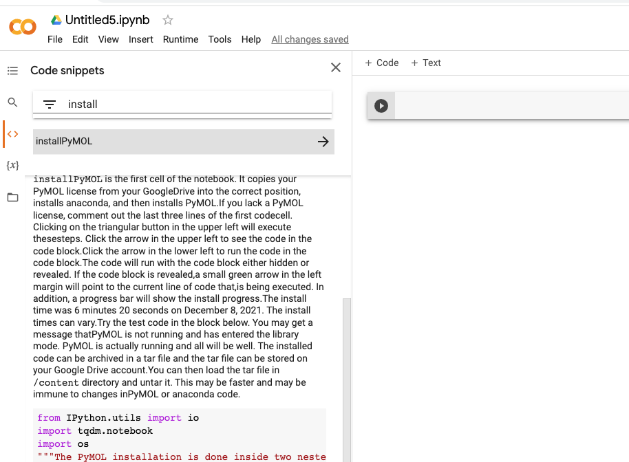
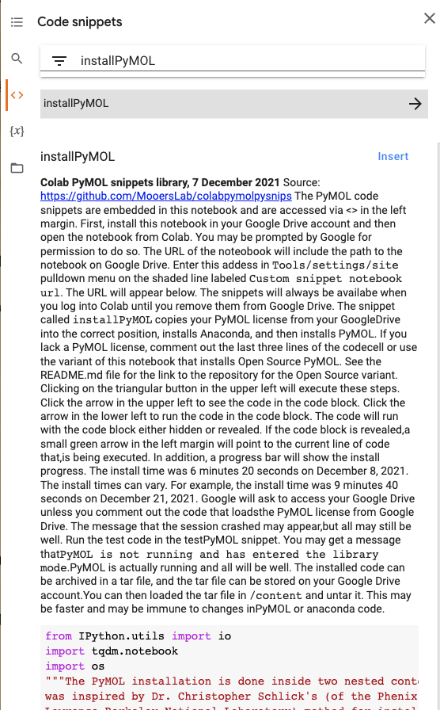
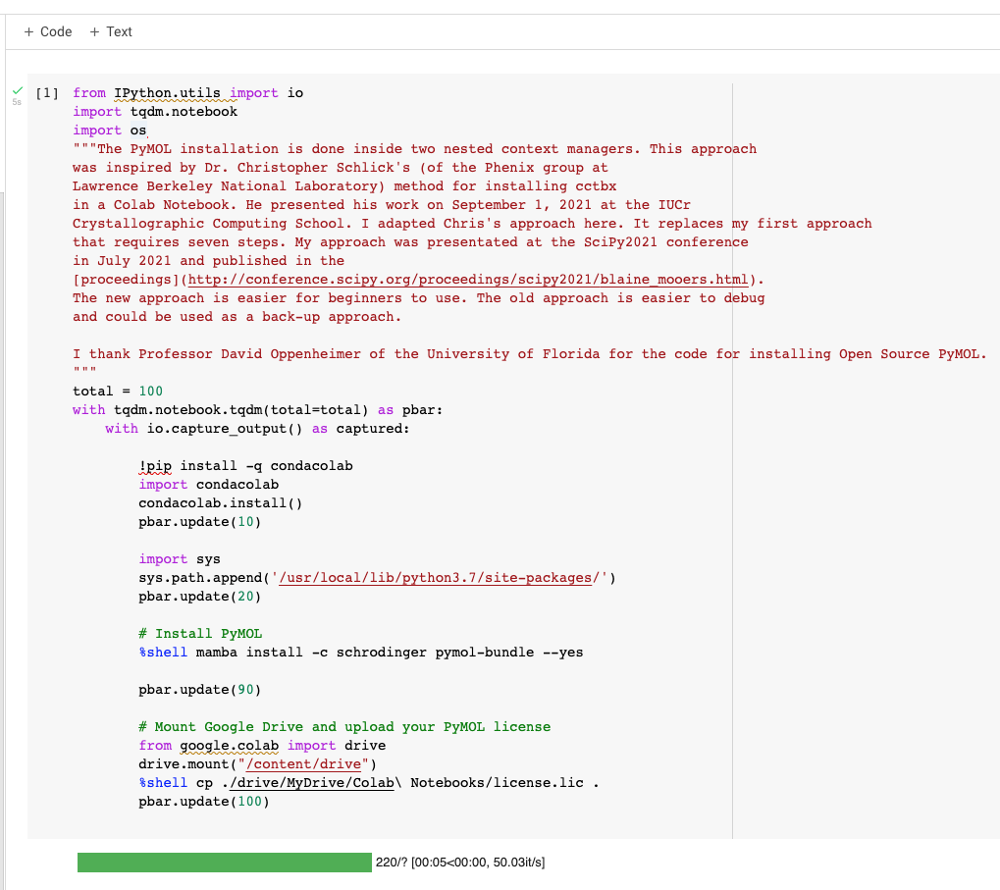
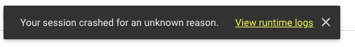
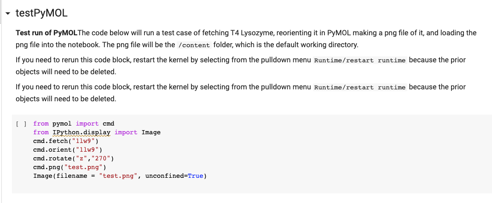
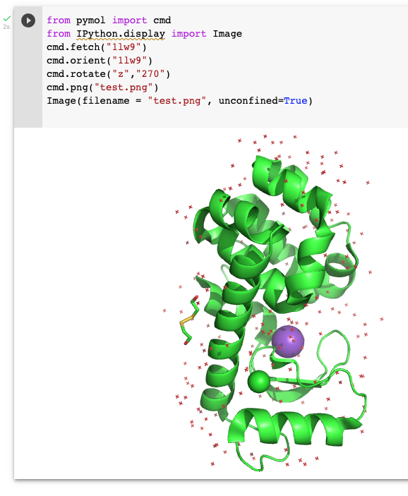

# colabpymolpysnips: 

## Library of PyMOL Python snippets for running Incentive PyMOL in Google Colab notebooks
#### This notebook requires a PyMOL license file in your Google Drive.
##### version 0.3

#### For the notebook that uses the Open Source version of PyMOL, [see](https://github.com/MooersLab/colabOpenSourcePyMOLpySnips).

Click on Colab badge to the right to open a notebook on Colab:

See the first cell in the notebook for the installation instructions.

The `installPyMOL` snippet will install PyMOL in one click of a button.
The install process takes 3-10 minutes, so be patient.
A progress bar monitors the installation. 

Pre-requisites: you need a Google Drive with some unused disk space. 
Google drive access comes with each gmail account.

### Step 1: Click on the above Colab link
This action will open the snippet notebook on Colab.
The top of the screen should look like the following:

### Step 2: Copy the snippet notebook to Google Drive

Use the `File/Save copy in Drive' pulldown menu item. 
If you ran some code cells, you may get a message like the following:

Ignore this warning. Click on `run anyway`i

### Step 3: Paste the URL of the snippet notebook into the settings

Paste the URL into the line `Custom snippet notebook URL`:

### Step 4: Open a new Colab notebook

### Step 5: Search for the installPyMOL snippet

### Step 6: Insert the installPyMOL snippet into the new notebook and run

This takes 5-10 mintues. 
Ignore this warning:

### Step 7: Insert the testPyMOL snippet and run

The result should be the following image:

### Step 8: Save the finished Colab notebook to Google Drive or download it to your computer.

## Related Repos

- [easypymol](https://github.com/MooersLab/EasyPyMOL/edit/master/README.md)
- [pymolshortcuts](https://github.com/MooersLab/pymolshortcuts)
- [pymolsnips](https://github.com/MooersLab/pymolsnips)
- [orgpymolpysnips](https://github.com/MooersLab/orgpymolpysnips)
- [rstudiopymolpysnips](https://github.com/MooersLab/rstudiopymolpysnips)
- [taggedpymolpysnips](https://github.com/MooersLab/taggedpymolpysnips)
- [jupyterlabpymolpysnips](https://github.com/MooersLab/jupyterlabpymolpysnips)
- [colabOpenSourcePyMOLpySnips](https://github.com/MooersLab/colabOpenSourcePyMOLpySnips)
- [PyMOLwallhangings](https://github.com/MooersLab/PyMOLwallhangings)
